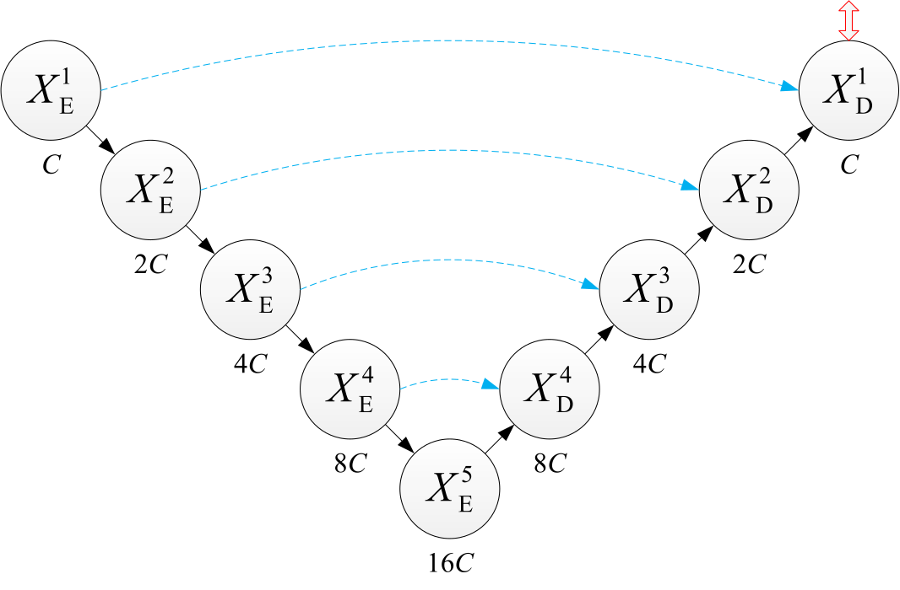
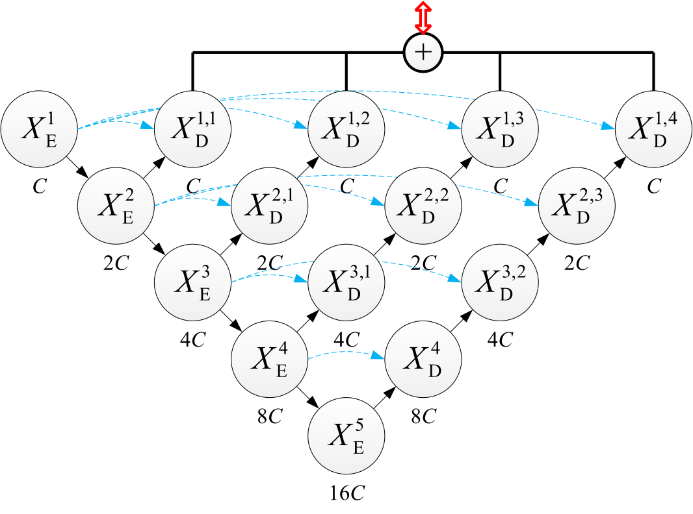
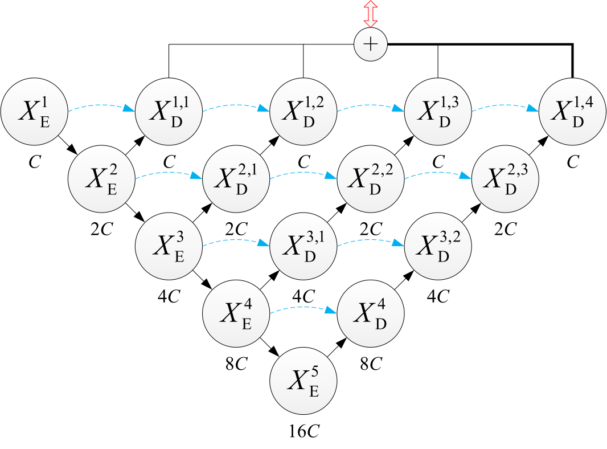
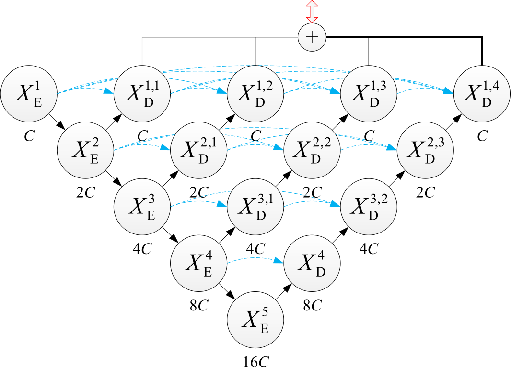
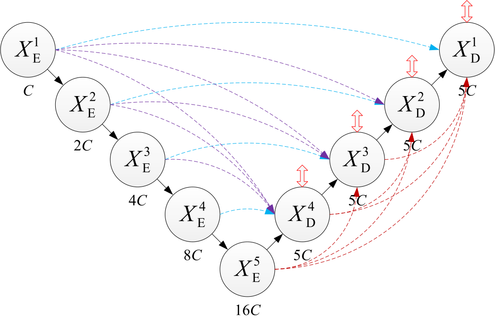
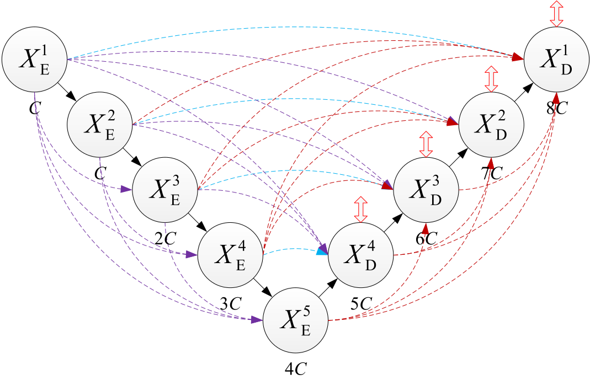

# UNet4Plus

UNet4+: A Full-Scale and Densely-Connected UNet Architecture for Historical Document Image Binarization

     

The architectural evolution from UNet, UNet+, UNet++, UNet3+, and finally to our proposed UNet4+. Each node in all subgraphs represents a convolution block, with the number of output channels shown below. The solid downward and upward arrows denote downsampling and upsampling, respectively. The dashed arrows indicate skip connections, where the light blue ones represent conventional skip connections between feature maps of the same scale, while the purple (requiring downsampling) and brown (requiring upsampling) represent full-scale skip connections between feature maps of different scales. The bidirectional hollow arrows indicate deep supervision and the thick solid lines are mandatory.

## Paper

This repository provides the official Keras implementation of UNet4+ in the following paper:

> **UNet4+: A Full-Scale and Densely-Connected UNet Architecture for Historical Document Image Binarization**  
> Wei XIONG  
> Submitted to **_Pattern Analysis and Applications_**, August 2025

Once the paper is accepted for publication, we will provide detailed instructions and release the pre-trained weight files.

Please stay tuned!
